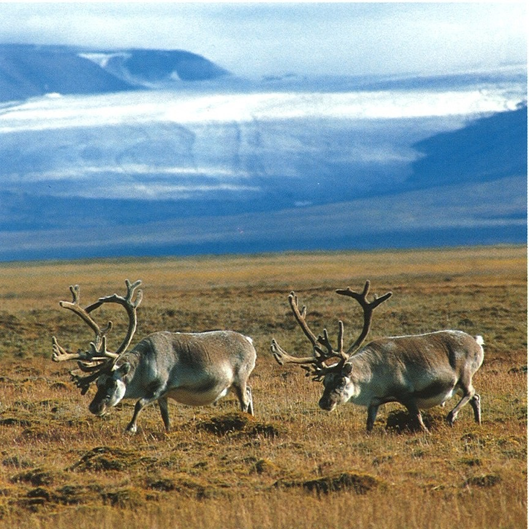
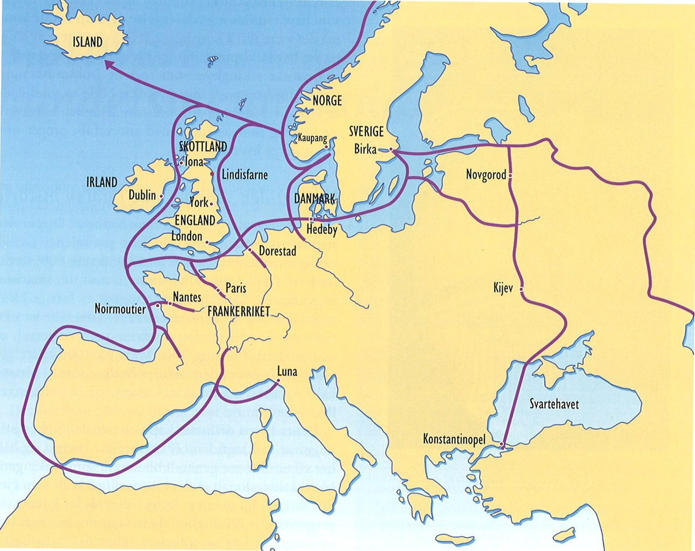
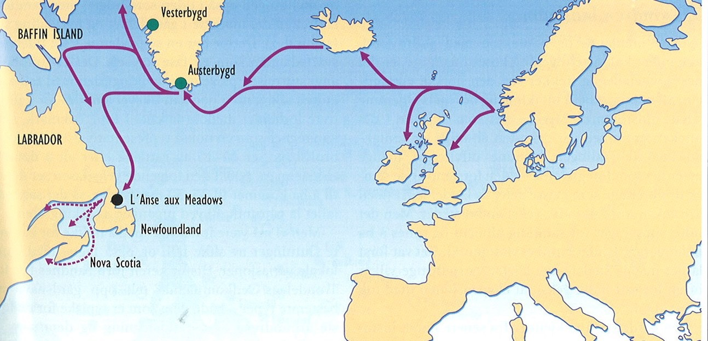

# Introduction to Norwegian History
HFEL0010, Autumn 2016

## Lecture 1 - 24.08.2016

### Early Days

Why did people migrate to the north, 10'000 years ago?  
-> They moved because of *resources* like fish, reindeer, etc... 

Slowly, coming from the south, *agriculture took the upper hand* in the country over gathering. Gathering remained important for quite a long time.

### Agricultural Revolution in the north

**Advantages** of agriculture:

* Reliability
* Can stock up food
* Feeds more people

**Disadvantages** of agriculture:

* Difficult to grow
* Requires a lot of work (Hunter gatherer societies use less work on average, since they have periods of hunting / gathering and periods of rest)

Stocking up food leads to *social political structures*, where some people have power over other people, since they are controlling the stocks, supply, etc… Agriculture also introduced the need for metal tools, which lead to increased productivity and *better weapons -> concentration of power in a small group*. Establishment of military power.

### Structure in early Norway

Large number of small political units along Norway. 

After 600, Norway enters european consciousness.

Ottar shows an *integrated trade economy all along Norway, Denmark and England*, as well as a *one big cultural and linguistic region*. No mention about any large political structures in this region.

### Viking expansion

The Viking Age begins with a raid on monastery in northern England. Raiders singled out rich institutions as their targets. Raids later expanded to more regions, like the east and to large rivers in Europe.

Trade & the viking expansion of settlements are two important aspects that happened at the same time. Settlements in north atlantic islands -> Iceland, Shetland, Faroese, Greenland, because of a *population surplus, better ships and the concentration of power*. The new settlements depended on trade with Norway. Iceland grew to ca. 20000 inhabitants.

Local trade was very important: furs, amber, tusks and also luxury products. Scandinavians became *more integrated* into the european trade network.

Viking expansion:

* Why: Population surplus, better ships, concentration of power
* How: Trade, Settlements, Plunder
* Consequences: Further Concentration of wealth and power, Spread of norse culture and trading networks in the north atlantic, Import of religious and political ideas

### Chieftains

A chieftain lived in a big house on his farm. His slaves / workers lived on the same land, but in a smaller house. Around the land of the chieftain was the land of other farmers, where they had their houses, but it was also controlled by the chieftain. There was other spheres of influences of chieftains. Some people were in the middle of two spheres and they seek out one of them, that gave them the most profit and protection. Almost all people were "forced" to join one chieftain and give him his loyalty and support by joining his raids.

The chieftains’ power:

* Economic power: Wealth, ownership of land
* Personal power: Slaves and dependants
* Legal power: Loyal followers at legal assemblies
* Maintaining and increasing power: War, strategic alliances (marriage, friendship)

### Ting

A Ting was a legal assembly, where all free men would meet and settle disputes, that were destabilising society (Settlements in court). Whoever could gather the most support would win the dispute. People would go to the legal assembly with their chieftain and support him. Therefor it was important to have a lot of people loyal to the chieftain. More influential people could influence the outcome more, since there was no strict laws. 

### Introducing laws

More wealth from trades and raids leads to fewer but more powerful chieftains -> decentralised aristocratic society.

Through raiding and trading and thus the contact with more advanced states, Norwegians were inspired to adapt some of those political units. Slowly, larger regions introduced unwritten laws / rules. As this became more complicated, some people (*lagmenn* - early form of judges) would memorise the rules and give advice. In the 11th century, those laws were written down.

* *-rike* suffix -> empire
* *-land* suffix -> community with similar culture
* *-lag* suffix -> lag = law, meaning that there is some sort of law on a regional scale. Eg: *Trøndelag*

### The Håløyg and Ynglinge dynasties

Håløyg family had their base in northern Norway and expanded southwards. Ynglinge family was in the south and expanded northwards. In the end, Ynglinge gained the upper hand. Harald Hårfagre became the first king and Norway became a kingdom. They controlled the area from Stavanger to Ålesund. The earls of Lade controlled the area north of that.

Establishment of the kingdom:

* Larger political units
* Regional legal territories (Gulating, Frostating)
* Concentration of power to very few families
* The earls of Håløyg/Lade-dynasty and the kings of the Ynglinge-dynasty share power from the late 9th century

### Snorre Sturlason

Most information about this time comes from *Snorre Sturlason*. The core of the sagas were true, but exaggerated. The sagas are representing the political climate of the 13th century with stories about the 9-10th centuries.

## Lecture 2 - 31.08.2016

After Harald died, the kingdom fell apart. 930 - 1030 is a time of political disintegration, but also a time of development of state-like structures. 

What makes a state?

* Laws
* Monopoly of violence -> army
* Taxation

The kingdom of Norway in the 10th century:

* Disintegration, danish dominance
* Establishment of legal structures
* Taxation
* Ambulating king with local representatives
* Attempts at christianisation

Early on, the laws were not written down, but by the 11th century, laws are being written down. They regulated the obligations between the king and his subjects. 

Taxation was in form of tributes, which could be in the form of food, metals or services (military obligations). 
The *Leidang* (coastal defensive military system) system created many smaller districts (300 in Norway). Each Leidang had their own ship. The king could mobilise all of them within a few days by use of fire signals along the coast. Later the Leidang system could also be used not only for defense but also as a general military attack force.  
In the 11-hundreds, the taxation moved more to goods instead of military services to ensure peace. 

The kings had a lot of wealth (gold, goods, lands) and thus a royal property was being created. They were spread out all over the country and thus the king needed a network of loyal servants (often from modest backgrounds since they are dependent on the king). The *Årmann* were those in charge. The king and his following was visiting/checking on them from time to time, being an unpredictable presence and thus assuring loyalty. 
The personal following of the king is called *hird*. The king has no capital to reside in; he travels around the country the whole time. 
The kings had a large number of sons and daughters. Any of the sons could claim kingships. Because a lot of people were fighting each other to claim the throne, the kingdoms were falling apart. 

### Religion

Håkon imported ideas of how to organise his "gang" and also christianity. 

The kingdom of Norway in the 11th century:

* Conversion to christianity from paganism
* End of danish overlordship and dominance
* Stable kingship 1035 - 1130
* Ecclesiastical organisation (parishes and sees)

The kings had economical and religious power. There were gods for every kind of people. It strengthened the people but was decentralised. Christianity was very centralised and this way of thought was more in line with a state. 
The import of slaves meant that a small christian element was already present in the population. Christianity was also already known by the vikings.

Kings would do their missionary work violently. A lot of energy was put into changing the reigning aristocracy into christians. The church is a part of the kings ruling apparatus. Kings were made to saints.

In the 11th century a more permanent christian system was introduced. The local churches were built by the local aristocracy. They remained in power throughout the religious change. The church had royal protection and the king used the reading/writing skills of the church.

### Social groups

* Slaves (*Trell*)
* Semi-free (*Løysing*)
* Free men (*Bonde*)
* Free men owning their land (*Hauld*)
* Aristocracy (*Lendmann*)

There was social mobility, but it would take generations for a group of people to become free. The slaves could be brought from England, Ireland or were born into slavery. The slaves themselves could never get free, but their offspring could. Drinking, feasting and partying are a good way to get a loyal following. If a slave could hold one of these feasts for his masters, he could start the process of getting free if the master is satisfied by it. Their children would then be semi-free, i.e. their obligations to the masters would become less strict. (It would take ca 8 generations to get free). The group of semi-free people constituted a large part of society. 

The free men could have their own farm and didn't have to respond to anyone. 

Marriage is a way of social mobility.

### Farms

What is a farm? Agrarian terms:

* *Gård*: A farm consisting of one or several households. Taxable unit.
* *Bruk*: One such household and its buildings and resources

A gård starts resembling a village requiring a high degree of cooperation and coordination. 

Below and above the farms are fields. The farm itself lies about 200m over the fjords. The land below was very good land. Above the upper fields (lesser quality) was the woods. All households had good fields and not so good fields. All households should have had access to the sea to fish.

There was many quarrels about the land and its heritage. 

### End of slavery

Slavery disappeared in the 12th century. In the written laws of the 13th century, there was no regulations about slaves. The influx of slaves stopped, but was not the reason for the abolishment of slavery. The reason is the continuous increase in population. It became a lot more economic to just rent out the land, instead of having slaves. The prices to rent out land became higher and higher and generated more income. 

### Skyldeiesystemet

A system of land-rent:

* A fixed rent (usually 1/6 of produce)
* One agrarian unit can have several owners, with ideal parts in the rent
* A farmer can be both tenant and owner
* Fragmentation of property through inheritance, sale and gifts
* Fragmentation contradicted by active policies of arrondation

The rent gets split up among the offspring of the owners. The sons get twice as much as the daughters. The rent gets disintegrated amongst several generations and different owners. High degree of fragmentation of property. 

Large portions of the farming populations are free people, even though they have economic dependency on land owners. 

# Lecture 3 - 07.09.2016

From 1030s to 1130s, Bishops were residing in Trondheim, Oslo and Bergen. People paid taxes (tithe = 1/10) to the church to get their services.  
No strict inheritance laws (any son could become king) could lead to peaceful sharing of lands but also to fights. In the 10-11 hundreds, this calmed down. The church introduced monogamy, which limited the number of legitimate offsprings, but bastard sons and half brothers continued to claim the throne. By the 1130s this system of power sharing between brothers collapses into conflict and warfare. 

Some problems: 

* Anyone could come and claim to be a bastard son of some king, but it needed some form of backing from friends of the aristocracy. In the 12th century, aristocracy revolved around the king, since it gave them benefits.  
* Need aristocratic support
* Need to have control over an area

Civil wars ca 1130 - 1240:

* All brothers inherit the kingship on an equal footing
* The development of aristocratic fractions
* Primogenitur (oldest legitimate son only) as a guiding principle from the 1160s
* Permanent division of the kingdom ca 1180-1217
* Minor uprisings 1220s and 1240
	
The church:

* Separate church province (archiepiscopal see) 1152/53
* Spans the north Atlantic
* Supports strong, centralised monarchy
* Conflicts with king Sverre late 12th century: Attempts to liberate the church from royal dominance

The arch bishop in Norway had several sub bishops. There now were 10 bishops in Norway. This made the church into a very powerful organisation, which people counted on. 

## Conflict between King and Church

Magnus Erlingsson (1163) could not legitimately claim the throne. In order to get their son to be king and to get support for their illegitimate dynasty, Erling and his wife had to get support from the church. They gave a letter of privileges to the church. The rules of inheritance were designed by christian values (only legitimate sons; the oldest legitimate son; ...). 

The church could depose of a king if he had a "mental illness". Mental illness could mean ruling against the will of god. Thus the church had some controlling power over the king.

In the 1150/60s the cult of St. Olav gained a lot of momentum. 

Magnus Erlingsson and his father fought with many contenders to the throne. Magnus defeated the kings in Trøndelag one by one (these kings were children - puppets for aristocratic factions who used the kings for their purposes). 

Sverre Sigurdsson (1177) was a priest (thus educated) from the Faroe islands and had no ties with any aristocratic factions. He came to Norway and had the mission to take inheritance from his deceased father. He also had a military strategic competence. He beat Magnus Erlingsson and his father and was the sole king of Norway. He controlled Trøndelag and faced resistance from the Westnorwegians. The church was amongst his enemies, since they were allied with Magnus Erlingsson.  
King Sverre was a good speaker and rallied agains the bishops. This created a conflict between him and the bishop in Trondheim.  
In the long run, King Sverre won the struggle. 

Håkon Håkonsson (1217) (grandson of Sverre) basically ended the big conflicts with the church. It was a period of consolidation and strengthening of local power and was seen as a peak of a centralised kingdom. The system changed from a travelling king to a king who settled in one of the major cities which then developed. Trondheim was one of these cities, but Bergen became the king's favourite.  
A network of fortifications were built all over Norway as a manifestation of royal power. Also a system of permanent offices was introduced (like a government), based on the clergy. The king and not the bishop had control over the churches.

Norway was divided into a set number of administrative regions. The *sysselmenn* (appointed from people from the aristocracy) were appointed to govern and uphold these regions and collect taxes. 

Royal government ca. 1200-1350:

* Regular taxation (*leidang*)
* The country divided into districts (*sysler*)
* Royal control of the legal system (*Landslov* 1274, royal appointment of *lagmenn*)
* Central chancellery (Mariakirken)
* Geographical expansion 12th and 13th centuries

The king is now the lawmaker and merges all the law codes into one law for the whole country. The lagmenn become royal men of the law. He designs the laws in line with the existing ones but develops them further. 

The arch bishops could have 120 armed forces, the bishops 40. There was a judge at every local cathedral. 

The norse atlantic islands accepted the overlordship of the Norwegian king. The Norwegian kingdom was more and more integrated into the central european culture. 

Summing up so far:

* Before ca 900: Vikings: Raiders, traders, colonisers. Chieftains and slaves.
* 900 - 1050: The establishment of a Norwegian kingdom
* 1050 - 1130: Shaky stability. Establishment of a church organisation.
* 1130 - 1220: Civil wars. The church more important. From slavery to free men.
* 1220 - 1350: Strong, centralised kingdom in cooperation with the church

	
With the rise in population, more and more groups had to settle for bad lands with high rents and thus a large part of the population were becoming poor and hungry. There was too little resources for this large population. 
	
The Black Death

* First deaths in 1346. In 1348 it reached Norway.
* Probably transmitted by rats and fleas (thus long travels by ships possible)
* The fleas had rats as their hosts and when the rat died, the flea also took humans as their hosts
* Within a few years, the plague spread all over europe
* 30% to 60% drop in population (from ca 450'000 to 150'000)
* Contraction of cultivated land
* Fall in the rent from land (75%)
* Fall in the prices of land (50%)
* Fall in the tithe (40-60%)
	
The Black Death changes the overpopulation problems over night. The animals and lands couldn't be cared about, since there was not enough people for that task. Thus also after the plague ended, there was large starvation. 

In the 1360s, there was the Children's Plague. These outbreaks continued (but less and less impactful) about every 10 years until about 150 years later. The survivors claimed all the newly available land and there was enough land again. The price for land rents dropped dramatically (average 75% drop). People from worse farmlands (high altitude areas) moved to better farms (low lands) and people from the inland moved towards the ocean (could also fish). Some of these farms in the mountains were deserted for several decades / centuries. 

Because the farmers had more land, they didn't grow only grains anymore, but produced also more luxurious goods, like cattle and cheese.
 
In the 1530s, the church owned about 40% of the lands, the nobility/aristocracy about 20% and the king about 7% and the remaining was owned by farmers and people in the cities. 

The church got more land after the plagues. There were a lot of gift giving to the church, since it was a time of uncertainty. 

Priests were exposed a lot to people afflicted by the plague. In Trondheim, the arch bishop died. 1 of the 20 of the bishops survived. Perishes in the mountains were abandoned or merged. 

Since the king didn't own that much land, the main drop in income came from the taxes. The taxes didn't sink that much and the high taxes were accepted, since they earned a lot more. 

The high aristocracy handled the plague quite well and could keep their position, but the lower aristocracy took a big hit. They had to give up their lifestyle and many switched to being fairly wealthy farmers. 
