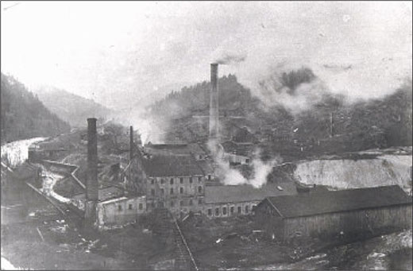
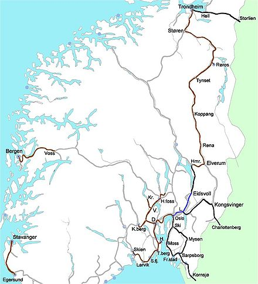

# Introduction to Norwegian History
HFEL0010, Autumn 2016

## Lecture 1 - 24.08.2016

### Early Days

Why did people migrate to the north, 10'000 years ago?  
-> They moved because of *resources* like fish, reindeer, etc... 

Slowly, coming from the south, *agriculture took the upper hand* in the country over gathering. Gathering remained important for quite a long time.

### Agricultural Revolution in the north

**Advantages** of agriculture:

* Reliability
* Can stock up food
* Feeds more people

**Disadvantages** of agriculture:

* Difficult to grow
* Requires a lot of work (Hunter gatherer societies use less work on average, since they have periods of hunting / gathering and periods of rest)

Stocking up food leads to *social political structures*, where some people have power over other people, since they are controlling the stocks, supply, etc… Agriculture also introduced the need for metal tools, which lead to increased productivity and *better weapons -> concentration of power in a small group*. Establishment of military power.

### Structure in early Norway

Large number of small political units along Norway. 

After 600, Norway enters european consciousness.

Ottar shows an *integrated trade economy all along Norway, Denmark and England*, as well as a *one big cultural and linguistic region*. No mention about any large political structures in this region.

### Viking expansion

The Viking Age begins with a raid on monastery in northern England. Raiders singled out rich institutions as their targets. Raids later expanded to more regions, like the east and to large rivers in Europe.

Trade & the viking expansion of settlements are two important aspects that happened at the same time. Settlements in north Atlantic islands -> Iceland, Shetland, Faroese, Greenland, because of a *population surplus, better ships and the concentration of power*. The new settlements depended on trade with Norway. Iceland grew to ca. 20000 inhabitants.

Local trade was very important: furs, amber, tusks and also luxury products. Scandinavians became *more integrated* into the European trade network.

Viking expansion:

* Why: Population surplus, better ships, concentration of power
* How: Trade, Settlements, Plunder
* Consequences: Further Concentration of wealth and power, Spread of norse culture and trading networks in the north Atlantic, Import of religious and political ideas

### Chieftains

A chieftain lived in a big house on his farm. His slaves / workers lived on the same land, but in a smaller house. Around the land of the chieftain was the land of other farmers, where they had their houses, but it was also controlled by the chieftain. There was other spheres of influences of chieftains. Some people were in the middle of two spheres and they seek out one of them, that gave them the most profit and protection. Almost all people were "forced" to join one chieftain and give him his loyalty and support by joining his raids.

The chieftains’ power:

* Economic power: Wealth, ownership of land
* Personal power: Slaves and dependants
* Legal power: Loyal followers at legal assemblies
* Maintaining and increasing power: War, strategic alliances (marriage, friendship)

### Ting

A Ting was a legal assembly, where all free men would meet and settle disputes, that were destabilising society (Settlements in court). Whoever could gather the most support would win the dispute. People would go to the legal assembly with their chieftain and support him. Therefor it was important to have a lot of people loyal to the chieftain. More influential people could influence the outcome more, since there was no strict laws. 

### Introducing laws

More wealth from trades and raids leads to fewer but more powerful chieftains -> decentralised aristocratic society.

Through raiding and trading and thus the contact with more advanced states, Norwegians were inspired to adapt some of those political units. Slowly, larger regions introduced unwritten laws / rules. As this became more complicated, some people (*lagmenn* - early form of judges) would memorise the rules and give advice. In the 11th century, those laws were written down.

* *-rike* suffix -> empire
* *-land* suffix -> community with similar culture
* *-lag* suffix -> lag = law, meaning that there is some sort of law on a regional scale. Eg: *Trøndelag*

### The Håløyg and Ynglinge dynasties

Håløyg family had their base in northern Norway and expanded southwards. Ynglinge family was in the south and expanded northwards. In the end, Ynglinge gained the upper hand. Harald Hårfagre became the first king and Norway became a kingdom. They controlled the area from Stavanger to Ålesund. The earls of Lade controlled the area north of that.

Establishment of the kingdom:

* Larger political units
* Regional legal territories (Gulating, Frostating)
* Concentration of power to very few families
* The earls of Håløyg/Lade-dynasty and the kings of the Ynglinge-dynasty share power from the late 9th century

### Snorre Sturlason

Most information about this time comes from *Snorre Sturlason*. The core of the sagas were true, but exaggerated. The sagas are representing the political climate of the 13th century with stories about the 9-10th centuries.

## Lecture 2 - 31.08.2016

After Harald died, the kingdom fell apart. 930 - 1030 is a time of political disintegration, but also a time of development of state-like structures. 

What makes a state?

* Laws
* Monopoly of violence -> army
* Taxation

The kingdom of Norway in the 10th century:

* Disintegration, danish dominance
* Establishment of legal structures
* Taxation
* Ambulating king with local representatives
* Attempts at christianisation

Early on, the laws were not written down, but by the 11th century, laws are being written down. They regulated the obligations between the king and his subjects. 

Taxation was in form of tributes, which could be in the form of food, metals or services (military obligations). 
The *Leidang* (coastal defensive military system) system created many smaller districts (300 in Norway). Each Leidang had their own ship. The king could mobilise all of them within a few days by use of fire signals along the coast. Later the Leidang system could also be used not only for defense but also as a general military attack force.  
In the 11-hundreds, the taxation moved more to goods instead of military services to ensure peace. 

The kings had a lot of wealth (gold, goods, lands) and thus a royal property was being created. They were spread out all over the country and thus the king needed a network of loyal servants (often from modest backgrounds since they are dependent on the king). The *Årmann* were those in charge. The king and his following was visiting/checking on them from time to time, being an unpredictable presence and thus assuring loyalty. 
The personal following of the king is called *hird*. The king has no capital to reside in; he travels around the country the whole time. 
The kings had a large number of sons and daughters. Any of the sons could claim kingships. Because a lot of people were fighting each other to claim the throne, the kingdoms were falling apart. 

### Religion

Håkon imported ideas of how to organise his "gang" and also christianity. 

The kingdom of Norway in the 11th century:

* Conversion to christianity from paganism
* End of danish overlordship and dominance
* Stable kingship 1035 - 1130
* Ecclesiastical organisation (parishes and sees)

The kings had economical and religious power. There were gods for every kind of people. It strengthened the people but was decentralised. Christianity was very centralised and this way of thought was more in line with a state. 
The import of slaves meant that a small christian element was already present in the population. Christianity was also already known by the vikings.

Kings would do their missionary work violently. A lot of energy was put into changing the reigning aristocracy into christians. The church is a part of the kings ruling apparatus. Kings were made to saints.

In the 11th century a more permanent christian system was introduced. The local churches were built by the local aristocracy. They remained in power throughout the religious change. The church had royal protection and the king used the reading/writing skills of the church.

### Social groups

* Slaves (*Trell*)
* Semi-free (*Løysing*)
* Free men (*Bonde*)
* Free men owning their land (*Hauld*)
* Aristocracy (*Lendmann*)

There was social mobility, but it would take generations for a group of people to become free. The slaves could be brought from England, Ireland or were born into slavery. The slaves themselves could never get free, but their offspring could. Drinking, feasting and partying are a good way to get a loyal following. If a slave could hold one of these feasts for his masters, he could start the process of getting free if the master is satisfied by it. Their children would then be semi-free, i.e. their obligations to the masters would become less strict. (It would take ca 8 generations to get free). The group of semi-free people constituted a large part of society. 

The free men could have their own farm and didn't have to respond to anyone. 

Marriage is a way of social mobility.

### Farms

What is a farm? Agrarian terms:

* *Gård*: A farm consisting of one or several households. Taxable unit.
* *Bruk*: One such household and its buildings and resources

A gård starts resembling a village requiring a high degree of cooperation and coordination.

Below and above the farms are fields. The farm itself lies about 200m over the fjords. The land below was very good land. Above the upper fields (lesser quality) was the woods. All households had good fields and not so good fields. All households should have had access to the sea to fish.

There was many quarrels about the land and its heritage. 

### End of slavery

Slavery disappeared in the 12th century. In the written laws of the 13th century, there was no regulations about slaves. The influx of slaves stopped, but was not the reason for the abolishment of slavery. The reason is the continuous increase in population. It became a lot more economic to just rent out the land, instead of having slaves. The prices to rent out land became higher and higher and generated more income. 

### Skyldeiesystemet

A system of land-rent:

* A fixed rent (usually 1/6 of produce)
* One agrarian unit can have several owners, with ideal parts in the rent
* A farmer can be both tenant and owner
* Fragmentation of property through inheritance, sale and gifts
* Fragmentation contradicted by active policies of arrondation

The rent gets split up among the offspring of the owners. The sons get twice as much as the daughters. The rent gets disintegrated amongst several generations and different owners. High degree of fragmentation of property. 

Large portions of the farming populations are free people, even though they have economic dependency on land owners. 

## Lecture 3 - 07.09.2016

From 1030s to 1130s, Bishops were residing in Trondheim, Oslo and Bergen. People paid taxes (tithe = 1/10) to the church to get their services.  
No strict inheritance laws (any son could become king) could lead to peaceful sharing of lands but also to fights. In the 10-11 hundreds, this calmed down. The church introduced monogamy, which limited the number of legitimate offsprings, but bastard sons and half brothers continued to claim the throne. By the 1130s this system of power sharing between brothers collapses into conflict and warfare. 

Some problems: 

* Anyone could come and claim to be a bastard son of some king, but it needed some form of backing from friends of the aristocracy. In the 12th century, aristocracy revolved around the king, since it gave them benefits.  
* Need aristocratic support
* Need to have control over an area

Civil wars ca 1130 - 1240:

* All brothers inherit the kingship on an equal footing
* The development of aristocratic fractions
* Primogenitur (oldest legitimate son only) as a guiding principle from the 1160s
* Permanent division of the kingdom ca 1180-1217
* Minor uprisings 1220s and 1240
	
The church:

* Separate church province (archiepiscopal see) 1152/53
* Spans the north Atlantic
* Supports strong, centralised monarchy
* Conflicts with king Sverre late 12th century: Attempts to liberate the church from royal dominance

The arch bishop in Norway had several sub bishops. There now were 10 bishops in Norway. This made the church into a very powerful organisation, which people counted on. 

### Conflict between King and Church

Magnus Erlingsson (1163) could not legitimately claim the throne. In order to get their son to be king and to get support for their illegitimate dynasty, Erling and his wife had to get support from the church. They gave a letter of privileges to the church. The rules of inheritance were designed by christian values (only legitimate sons; the oldest legitimate son; ...). 

The church could depose of a king if he had a "mental illness". Mental illness could mean ruling against the will of god. Thus the church had some controlling power over the king.

In the 1150/60s the cult of St. Olav gained a lot of momentum. 

Magnus Erlingsson and his father fought with many contenders to the throne. Magnus defeated the kings in Trøndelag one by one (these kings were children - puppets for aristocratic factions who used the kings for their purposes). 

Sverre Sigurdsson (1177) was a priest (thus educated) from the Faroe islands and had no ties with any aristocratic factions. He came to Norway and had the mission to take inheritance from his deceased father. He also had a military strategic competence. He beat Magnus Erlingsson and his father and was the sole king of Norway. He controlled Trøndelag and faced resistance from the Westnorwegians. The church was amongst his enemies, since they were allied with Magnus Erlingsson.  
King Sverre was a good speaker and rallied agains the bishops. This created a conflict between him and the bishop in Trondheim.  
In the long run, King Sverre won the struggle. 

Håkon Håkonsson (1217) (grandson of Sverre) basically ended the big conflicts with the church. It was a period of consolidation and strengthening of local power and was seen as a peak of a centralised kingdom. The system changed from a travelling king to a king who settled in one of the major cities which then developed. Trondheim was one of these cities, but Bergen became the king's favourite.  
A network of fortifications were built all over Norway as a manifestation of royal power. Also a system of permanent offices was introduced (like a government), based on the clergy. The king and not the bishop had control over the churches.

Norway was divided into a set number of administrative regions. The *sysselmenn* (appointed from people from the aristocracy) were appointed to govern and uphold these regions and collect taxes. 

Royal government ca. 1200-1350:

* Regular taxation (*leidang*)
* The country divided into districts (*sysler*)
* Royal control of the legal system (*Landslov* 1274, royal appointment of *lagmenn*)
* Central chancellery (Mariakirken)
* Geographical expansion 12th and 13th centuries

The king is now the lawmaker and merges all the law codes into one law for the whole country. The lagmenn become royal men of the law. He designs the laws in line with the existing ones but develops them further. 

The arch bishops could have 120 armed forces, the bishops 40. There was a judge at every local cathedral. 

The norse atlantic islands accepted the overlordship of the Norwegian king. The Norwegian kingdom was more and more integrated into the central european culture. 

Summing up so far:

* Before ca 900: Vikings: Raiders, traders, colonisers. Chieftains and slaves.
* 900 - 1050: The establishment of a Norwegian kingdom
* 1050 - 1130: Shaky stability. Establishment of a church organisation.
* 1130 - 1220: Civil wars. The church more important. From slavery to free men.
* 1220 - 1350: Strong, centralised kingdom in cooperation with the church

	
With the rise in population, more and more groups had to settle for bad lands with high rents and thus a large part of the population were becoming poor and hungry. There was too little resources for this large population. 
	
### The Black Death

* First deaths in 1346. In 1348 it reached Norway.
* Probably transmitted by rats and fleas (thus long travels by ships possible)
* The fleas had rats as their hosts and when the rat died, the flea also took humans as their hosts
* Within a few years, the plague spread all over europe
* 30% to 60% drop in population (from ca 450'000 to 150'000)
* Contraction of cultivated land
* Fall in the rent from land (75%)
* Fall in the prices of land (50%)
* Fall in the tithe (40-60%)
	
The Black Death changes the overpopulation problems over night. The animals and lands couldn't be cared for, since there was not enough people for that task. Thus also after the plague ended, there was large starvation. 

In the 1360s, there was the Children's Plague. These outbreaks continued (but less and less impactful) about every 10 years until about 150 years later. The survivors claimed all the newly available land and there was enough land again. The price for land rents dropped dramatically (average 75% drop). People from worse farmlands (high altitude areas) moved to better farms (low lands) and people from the inland moved towards the ocean (could also fish). Some of these farms in the mountains were deserted for several decades / centuries. 

Because the farmers had more land, they didn't grow only grains anymore, but also produced more luxurious goods, like cattle and cheese.
 
In the 1530s, the church owned about 40% of the lands, the nobility/aristocracy about 20% and the king about 7% and the remaining was owned by farmers and people in the cities. 

The church got more land after the plagues. There were a lot of gift giving to the church, since it was a time of uncertainty. 

Priests were exposed a lot to people afflicted by the plague. In Trondheim, the arch bishop died. 1 of the 20 of the bishops survived. Perishes in the mountains were abandoned or merged. 

Since the king didn't own that much land, the main drop in income came from the taxes. The taxes didn't sink that much and the high taxes were accepted, since they earned a lot more. 

The high aristocracy handled the plague quite well and could keep their position, but the lower aristocracy took a big hit. They had to give up their lifestyle and many switched to being fairly wealthy farmers. 

## Lecture 4 - 14.09.2016

### Commercial fishing

More people switched to commercial fishing (Northern Norway and Bergen). In the north, there was a lot of fish and preserving fish was made easy by the temperature, the wind and the high season of fish (outside the farming season). From February to May, the fish just gets hanged outside to dry in the cold wind. By June, the fish was dried and ready to export. The fishers would meet the German traders in Bergen. The fishing market was monopolised by the king and fishers had credit ties with the merchants. 

### Political development

* Royal union between Norway and Sweden 1319 - 1355
* Dynastic fight over the Swedish throne 1355 - 1396
* Royal union between Norway and Denmark from 1380
* The union of Kalmar 1397

In 1319, Håkon V died without a son. The oldest son of Håkon V's daughters was Magnus (3 years old). Sweden is kingless as well, but they don't have a law of inheritance. Magnus becomes king of both countries, but his mother leads the council in his stead. When the king is not present, the council gets the power to rule for the moment. The two councils remove the kings mother from power, as they want to keep as much power as they earned in the 1320's.  
Magnus had two sons, Erik and Håkon and the council dictated that Håkon (the younger one) has to be king and not Erik (so they had another child king and more power for themselves). (Magnus had the plan of making Erik the king of Sweden and Håkon the king of Norway).  
Erik starts a rebellion against his father and dies.  
The Swedish aristocracy was not pleased with Magnus and Håkon, so they depose of him and make Albrecht Mecklenburg the new king. Different aristocratic fractions in Sweden support the Norwegian and the German dynasties. 

Håkon marries the danish princess Margrethe and they have a son, Olav IV. The swedish king dies and Olav is enacted king of Denmark. He is the heir of the Norwegian throne and has claims to the Swedish throne. Again, the king is a child and the council rules. He died at 17 years old and had no descendants. According to the law of succession, Albrecht would get all, but the council moves aside this rule. 

* Albrecht shouldn't get the throne because he was in war with Norway
* A bastard grandson doesn't want the throne
* Margrethe gets to be the new starting point for the law of inheritance

The polish boy Bugislav/Erik becomes the new king. Through the 1390's, Margrethe also gets control over Sweden. From 1397 on, there is a union (of Kalmar) between the three countries.

* The council of the realm increases its political power
* Conflicts between the king/queen and the council of the realm: Regimen politicum and regimen regale
* Queen Margrethe and king Erik: strong monarchy

The terms of the union between the three kingdoms are discussed in Kalmar in 1397. Margrethe and Erik wanted regimen regale (centralised government, common foreign policy). The councils wanted regimen politicum (decentralised government, loose confederation). In the first phase, Margrethe and Erik got what they wanted.

[Aristocracy != nobility. The aristocracy were people who, to a certain degree, controlled economic means/people and had some influence. The councils were made up of the higher aristocracy.]

* 1430s: Rebellions against king Erik
* 1450s: The treaty of Bergen
* 1537: The reformation and abolishment of the Norwegian Council of the realm
* Weaker aristocracy 

After Margrethe died in 1412, Erik pursued some political goals like reclaiming old Danish regions and even going to war for this. The Germans were afraid of one big centralised Scandinavia, so they supported any effort against that, but Erik keeps the warfare up. Therefore he needs to raise taxes for the war. Raising taxes, spending them elsewhere and pushing away local people were not seen kindly upon. Erik also wanted to control the church. The fishing and mining economy collapses, since the traders boycott them. All of this leads to major rebellions against Erik, which results in all three countries deposing of the king. The councils all elect another king, the nephew of Erik, Christoffer. Now, regimen politicum reigns.

This falls apart and Christoffer dies and he has no heir. Norway moves to an elective monarchy. The Danish elect the duke of Schleswig-Holstein, Christian, which unites them with Denmark. The Swedish elect Karl. The Norwegian council elects Karl and Christian. Karl renounces his rights to a Norwegian throne (Norway not worth to fight over) and Christian becomes king. In 1450, they created the treaty of Bergen. 

The *håndfesting* is a contract that the sons of the kings have to agree with, if they want to be elected by the council. In some situations, the contract was quite strict, which was a major source of conflicts between the kings and the council. Often, the kings would break the contracts, since the aristocracy, and therefore the council were economically bad off. 

The church is increasingly dominating economics and also the council. The interests of the king and church were not always the same. By the 1520's, this turned into a political crisis. At the same time, there is a development to two centres of powers in Scandinavia (Sweden and Denmark/Norway). In the 1530's, the Lutheran church gains the upper hand. 

Christian III abolished the catholic church in Denmark. In one year, he gains military control in Norway. He takes over the council. There is no more a Norwegian catholic church or an arch bishop. Norway becomes like a county of Denmark. It is still a kingdom, but ruled from Copenhagen. 1537 marks the end of the Kalmar union.

## Lecture 5 - 21.09.2016

### Population growth

* Lowest level ca. 1500: Ca. 150'000
* Level of 1349 reached ca 1650: 450'000
* Continued growth ca. 1800: 800'000
* Explosion ca. 1850: 1'500'000

First growth was mainly recolonisation of old deserted farms that were only used for growing purposes. This lead to more income by taxes. The crown encouraged people to repurpose the farms with incentives like tax exemptions or land gifts. 

After the reformation, the land the church owned (40% of the lands) would get taken by the king. The crown increases thus its income and the bishops get less payment. Monasteries are abolished. A majority of the people become tenants of the crown. 

The rents for land rise again because of the population growth. The representatives of the king got a lot of concentrated power (legislators, tax collectors, property owners, ...).

### Royal administration 1537 - 1660

* Power delegated to governors (*lensherre*)
* Subdelegation of power from governors to bailiffs (*fogd*)
* Peasant resistance against corruption and *clientism*
* Attempts of royal control over administration through the legal channel

The *lensherre* controlled the so called *len* (kind of districts) and the more prestigious ones were called *slotslen*. The governors give a certain percentage of their income to the king. The governors had sub delegates called *fogd* administering smaller districts who didn't answer to the king but only to their governors. The king had no way of controlling this and a mafia like structure developed, since many saw it as a good opportunity to make money. There was the illegal way of opposing this system, rioting and resisting, but also the legal way over the king through letters to him giving him some leverage against corrupt governors. (Example of Luovig Munk - Governor in Trøndelag) The peasants wanted a fair law and the crown wanted their taxes. The government became more trustworthy. A commission was also crated to control the governors while traveling around Norway. In the 1660s, the king abolished the administration and gained total control. 

### New social groups & economy

* Crofters (*husmenn*)
* Day labourers
* Sailors
* Craftsmen in the cities

A more economic and socially diverse society developed. Crofters didn't own land. They had a farm that was so small that they couldn't be taxed. They instead payed rent to the farmers. Usually the landowners demanded mandatory labour (payed) from the crofters. The small farms were too small to support a family. This lead to the non-agrarian sector becoming more and more important (timber, fishing, mining). 

The development of large cities and need for more ships for trading, a lot of timber was needed. The crofters thus got work in the winter getting timber or fishing. In the early 16-hundreds, mines were established. 

This diversity of labour could support the population growth, where only agrarian work could not. Export means international trade which leads to the creation of cities and rapid urbanisation. 

### Restructuring of the economy

* New exports: Timber and metals (16th to 18th centuries)
* New towns and cities (17th to 18th centuries)
* Migration in a lifetime perspective

In south-western Norway, young people would usually spend some years abroad (eg. in Amsterdam) making money and then returning having the starting capital for a farm. There they could work as a sailor, in the tabac industry, as a prostitute, etc... 

In south-eastern Norway, people should trade in the kingdom first before buying products from other countries, even if the products were inferior (eg. buy grain from Denmark when there was a bad harvest).

The trading network also covered west (fishing) and east (grain from Russia). 

Farming techniques didn't change much until the age of enlightenment (late 18th century), where a discussion on how to improve farming work starts. In the 17-hundreds, Norway started to farm potatoes, which lead to a more solid base of nourishing the people. 

### The struggle for nordic domination 1563 - 1720

* 1563-70: The seven year war
* 1611-13: The Kalmar war
* 1643-45: The Torstensson war
* 1657-58: The first Karl Gustav war
* 1658-60: The second Karl Gustav war
* 1675-79: The Scanian war
* 1701-20: The great nordic war

In the period from 1563 - 1720, every generation experienced a war. They were always between Sweden and Denmark/Norway about the dominance in Scandinavia. Usually, the wars started with a power balance and ended with a power imbalance. From the 1640s to the 1660s, Sweden established itself as the main military power in the north.

In the times of wars, taxes were raised a lot to be able to afford soldiers and the royal system of taxation was made more efficient. Also, the population could be forced into becoming soldiers. The more efficient governments stayed also after the wars.

Coup of 1660:

* The council of the realm abolished
* Absolute rule for the king
* Sale of the royal domain (the crown's land)
* Predictable bureaucracy

In the Karl Gustav wars, the king was near to annihilate Denmark, when sieging Copenhagen, until he died. Money had to be loaned from the wealthy merchants of Copenhagen to defend the city and became bankrupt. Taxes were raised even more and groups that didn't have to pay taxes (aristocrats, nobility) now had to join in. [The priests prayed for the population. The aristocracy fought for the population (thus exempt from taxes). The rest fed the population.]  
The king invited all social groups to discuss this in assembly in Copenhagen, but the aristocracy refused. Therefore he closes all ways of them to leave the city, the aristocracy gives in and they will pay taxes and give the king absolute power. The council is abolished and the political landscape changes to an absolute monarchy. In exchange for debt, the king gives land in Norway as he couldn't pay. Merchants in Copenhagen and Amsterdam sold scattered properties to merchants in Bergen, since it cost too much to control scattered land in Norway from afar. Many farmers also bought their own farms from the merchants, getting fairly wealthy from that. So over time, land ownership went from the church to the king to the merchants to the farmers.

## Lecture 6 - 28.09.2016

### Absolute rule

* Local bureaucracy under royal control
* Modernisation of the legal system
* Economic monopolies - mercantilism

Under absolute rule, the king could freely choose his council. The government would thus be very loyal to the king. Not only the nobility, but also people who could prove their worth to the king could be instantiated in those positions. The government was therefore very efficient and didn't necessarily need the king. The law system was modernised and the courts were streamlined. 

In the mid 17 hundreds, the European monarchies were in a fight over resources. This leads to a protectionist economy. To protect inland producers, the king would give them monopolies or increase import taxes. 

### Growing dissent

* Economic dissent: Institutions for Norwegian foreign trade
* Patriotism: Separate Norwegian university
* Religious dissent: Preaching in private congregations
* Peasants dissent: Against taxes and monopolies

Denmark was a lot more self sufficient than Norway, that had to trade a lot. The bank was in Copenhagen, so Norwegian traders had to travel a long way to get a credit. This caused some economic dissent in Norway, since they did not get their own institutions.

A patriotism develops in Norway, which culminates in the request for a separate Norwegian university, that is not in Copenhagen. There already is a university in Kiel for the people from Schleswig-Holstein. 

Often, Absolutism was legitimised by the church. More and more people held private congregations and were jailed for such activities. 

The rhetoric that the king stole form the people developed. Several large peasant uprisings follow. 

### Independence 1814

* Denmark-Norway on the losing side in the Napoleonic wars
* Norway ceded to Sweden January 1814
* Norwegian rebellion: declared an independent, constitutional monarchy May 1814
* War with Sweden, defeat August 1814
* Personal union with Sweden November 1814; constitution intact

During the war, British ships patrolled the sea between Denmark and Norway, so communication between the two regions was impossible. 

The king could not:

* stray from the path of Lutherism
* give away a part of his kingdoms

The king was not fulfilling his obligations, so there was a claim on the throne from Kristian Fredrik. Denmark did not accept an absolute monarchy and only allowed independence with a constitution. When the constitution was written, Kristian became king. A war with Sweden starts in the summer. The Swedish crown prince accepts the Norwegian sovereignty and the constitution is slightly revised and accepted by the Swedish government. Norway had a separate national assembly and left to rule itself on internal matters. 

### The new state

* University in 1811
* National bank 1816
* The constitution: Balance of power
* 45% of all adult males have the right to vote
* Increased local authority from the 1830s

Freedom to choose one's own religion and free trade were now a constitutional right. A political balance was created.  
Vote was connected to gender and property (one had to pay taxes or own land that was taxable to vote). The crofter thusly did not have the right to vote. By the 1830s, to a increasing degree, farmers would elect farmers. They wanted as much power as possible to be delegated to the lowest level through the "Law of self governance". This lead to a lot of people getting educated in local politics. 

### Summing up: Political history

* From chieftains to centralised kingdom (700-1200)
* From petty chieftains to the king's aristocracy
* Centralised kingdom based on understanding with the church, legal monopoly and the right to tributes
* 1300-1500: The king's council formalises the power of the aristocracy
* Union between the nordic kingdoms 1300s to 1520s
* Conflicts between the king and the councils
* 1537: Norwegian council abolished. Union with Denmark until 1814

### Summing up: Economic history

* Agrarian sector dominates the whole period. Few innovations.
* Foreign trade: Luxury products (fur, amber, tusk, etc.) early and high medieval period
* Export of dried fish from the 1100s
* The role of the Hanseatic League
* Export of timber from the 16th century
* Export of metals from the 17th century
* Monopolies of the absolute state (mercantilism)
* The rise of local merchants

### Summing up: Social history

* Early medieval period: A society of systematically graded freedom
* 1100s: developments towards a society of legally free persons in contractual relationships about the use of land
* High medieval period: Overpopulation, crisis of resources, increased economic and social differences
* Late medieval period: Sudden drop in population, lack of labour
* Better economy and social standing for farmers
* Crisis for the aristocracy
* 1600s: Increased population. Increased social stratification.
* Crofters: New, lower social group, engaged in labour outside the agrarian sector
* Increased population in the cities and towns

## Lecture 7 - 05.10.2016

Important changes:

* Industrial revolution starting mid 19-hundreds
* Split with Sweden 1905
* Doubling of population (2*880'000) from 1800 to 1860. 2.6 Millions around 1920
* More than 500'000 move to the US
* A lot fewer farmers
* In 1850, 87% of the population lived on the countryside, in 1900 it was 72% and in 1946 only 50%. 
* Change from an agrarian society to an industrialised one

In 1854, the first rail road opens. Throughout the whole period, communication improves, giving access to travel (to work) and improves trading. Since Norway is a maritime country, the upcoming of steam boats improved communication in the country. The modern city, where people travel to to work is created. Farmers not only provided for themselves, but could also sell their products and get integrated into the economy. 

Around 1850, the first banks open and capital becomes more available. Free trade gets introduced and it gets cheaper to import from eg Russia and Amerika. 

1884 marked the beginning of parliamentarism (government accountable to the parliament) in Norway when the parties are created. The conservative and liberal  (late split into multiple) parties get created. In 1885, the labour party gets created, but only in 1903 gets access to the parliament. Only after the world war, the parliament gets far more accessible. In 1898, all men can vote and in 1913, also all women. 

The liberal party is the driving force for the split with Sweden. Sweden traded east- and southwards, while Norway traded westwards (dependant on the royal navy). The foreign policy of the kingdom of Norway-Sweden was the main source of conflict (the foreign ministers were always Swedes). Norway had one of the largest merchant marines (4th largest in WW1); Sweden not so much. The liberal party argued, that the foreign minister doesn't respond to Norwegian interests abroad. The conflict about Norway wanting a foreign counsellor evolves in the 1890s and in 1905, the union is broken up. 

Since there were several conflicts around the world at that time, it was important for Norway to show that they are not revolutionaries. The referendum about the split from Sweden was accepted with a big majority. There was also a referendum to decide if Norway should stay a kingdom or a republic. Haakon VII (a dane) gets king. He is married to the daughter (Maud) of the British king. Norway is therefore an independent country with relations to Denmark and Great Britain (important for the sea sovereignty). 

From 1900 up to the start of WW1, Norway starts exploiting hydro energy a lot. 

Norway stayed neutral during WW1, but was still influenced heavily by it. In the first half, the merchant marine gained a lot of money, but took big hits in the second. Eventually, Britain controlled the Norwegian fleet and Norway had to join the blockade of Germany. 

The Norwegian perception of security: They were "outside" Europe, had close ties to Britain and didn't have threatening interests / were independent. 

## Lecture 8 - 12.10.2016

Economic cycles 1840-1920:

* Before: Traditional industries with little development
* 1840-1875: Growth - New industries and development of new industries
* 1875-1890: Stagnation - Norwegian economics are and were closely tied with international economics
* 1890-1900: Growth
* 1900-1905: Stagnation - Crisis
* 1905-1917: Growth - At beginning of war, there was a high demand in eg fish and shipping businesses

Times of crisis forced people to innovate. 

Pre-industrial Norway:

* An agricultural, rural area
* Small towns (Being or not being a town was a matter of legislation)
* Proto-industries
	* Sawmills (powered using water)
	* Mines (copper, silver, iron-ore)
	* Iron-works
* Export industries
	* Forestry (timber)
	* Fisheries
	* Shipping  

During the late 19th century and mainly after 1920, the percentages of people working in primary, secondary and tertiary  (commerce, trade, offices) industries shifted drastically. 

###Agriculture: Growth and changes

Most of the people were farmers (mostly relatively small landowners), workers at farms, crofters (*husmenn*), fishermen or sailors.  
The "husmann"-system fell into decline from the 1860s. Many crofters moved away from the rural areas and got jobs in new industrial sectors. So the percentage of people in rural areas was falling, while the overall number of people was rising (also on the land).

Agriculture and the market economy: 

* Growth in productivity
* Better cultivation, new crops (potatoes) leads to more efficient food growth
* New working methods
* Better organisation of properties (Defragmentation of lands)
* Mechanisation
* Better communications
* Producer cooperatives (farmers took control over the distribution of their products. No middle man -> more profit)

###Fishing

* Growth in exports from the 1830s (High demand in Europe for cheap food. Norwegian fish was cheap)
	* Herring and *Klippfisk*
* Mechanisation and deep-sea fishing form 1890s. Before, fishing was done in small, open boats along the coast using traditional methods. Bigger steam boats meant, that one could wander off further out into the open sea. 

###Forestry

* Growth in demand and rising prices on timber from the 1840s
* Exports from timber because of higher demand in Europe (since there also was a rise in population)
* Rising wood products industry from the 1870s
* Paper production. Rising demand for news papers.
* British investments and knowledge import

###Shipping - Norway as a great power

* Steady growth from the 1820s
* 1878: The Norwegian merchant fleet was the third largest in the world
* Trading for other countries in Europe, but later also for the Americas
* Norwegian and Swedish exports
* The Navigation Act repealed 1849 (Only British ships could transport goods to and from Great Britain)
* Wooden sail ships
* Low cost, low wages -> Norwegian ships could compete with other countries. 

From sail to steam:

* Slow changeover from sail to steam (For a long time more economical to not buy expensive, but more efficient steam ships)
* Investments in steam boats from 1890
* Shipping was of vital importance for Norwegian economy

###Better communications

* Railways (Oslo-Trondheim travel time shrunk from one week to one day)
* Steamboats
* Better postal services
* Telegraph, telephone

###Norwegian industrialisation

* Early industrialisation ca 1840-50 (mainly textile industries in the central areas of eastern Norway around Oslo along rivers to use hydro power)
* Steady growth 1860-75
* Industrial breakthrough 1890-1914

A first wave of industrialisation (1840s-1870s):

* New industries
	* Textiles
	* Mechanical engineering
* Important preconditions / explanations:
	* Population increase
	* Urbanisation
	* Liberal economic policy
	* Technology import

The second phase of industrialisation (1870s-1900):

* Based on traditional natural resources
* Timber:
	* Saw mills (now mechanised, steam sourced)
	* Mechanical pulp
	* Cellulose / chemical pulp
	* Paper
* Fishing
	* Canning industry (high demand in Europe at the beginning of WW1)
	* Mechanisation

An industrial nation (1900-1914): Electricity:

* New growth industries:
	* Electro chemicals (Fertiliser, Norsk hydro 1905)
	* Electro metals (aluminium, zink, nickel, carbid, ...)
	* Electro technical (turbines, dynamos)
* Preconditions / explanations:
	* Hydro electric power very useful and easy to implement for high energy demanding tasks
	* Technological advances
	* Foreign capital / investments

The Norwegian road to industrialisation:

* Comparative advantages: Natural resources
* Technology import, "catching-up"
* Import of foreign capital
* Export-led growth
* A "Norwegian System"? 
* "A small and lucky imitator" (imitated especially the British industry)
* "Democratic capitalism" (Norway more egalitarian than elite driven Sweden)

Democratic capitalism:

* United principles of democracy, justice and equality
* Industries were locally based and relatively autonomous
* Political control
* Local industries led by a strong *petit-bourgeoisie* with its democratic norms
* Dual economy:
	* Small industry: Local capitalism, domestic market
	* Big industry: Foreign capital, export

The role of the state:

* Quite liberal
* Organiser of growth and development
* Low taxation
* System for the provisions of credit
* Development of communications
* Regulator and legislator
* Concession laws 1906
	* Water rights in private hands would eventually become subject to public ownership

## Lecture 9 - 19.10.2016

### The interwar period

* Turbulent times, period of restructuring and conflicts
* Time of upheaval in Norway and in the world (politically, economically, socially)
* Socialism - capitalism ?
* State planning - free market ?
* Revolution - reforms ? (Russian revolution in 1917)
* Democracy - dictatorship ? (several fascist movements in Europe)

Norwegian politics:

* From instability and conflict to collaboration and unity
* Many labour conflicts in the 1920s and 30s because of bad pay and working conditions
* 1918 - 1935:
	* Short-lived, unstable minority governments (for the most part) formed by right side and center parties
	* There was a small communist party (15%)
	* Never a big fascist movement in Norway
	* Political polarisation
* The Labour Party from a revolutionary to a reformist and national party
	* Largest party from 1927
	* Short-lived government 1928 (in power for 2 weeks, since more conservative parties became afraid of a socialist government)
* The 1935 agreement between the Labour Party and the Agrarian Party
	* Stability and reduction in tensions between political parties
	* Fewer labour conflicts

Norwegian economy 1905 - 1939:

* 1905 - 1917: Growth
* 1917 - 1935/39: A period of turbulence
	* 1918 - 1920: Growth and inflation (High demand for commodities)
	* 1921 - 1925/28: Recession
		* High debts, banking crisis
		* Shipping, from crisis to growth crisis
	* 1925/28 - 1930: Growth (slow from 25-28)
	* 1930 - ca 1932: Crisis
		* The Stock Market Crash 1929 and "The Great Depression"
		* International crisis (Norways wellbeing was closely tied with the rest of the world)
	* From 1935: Growth

"Growth through crisis":

* Norwegian economy 1875 - 1890 and ca. 1925 - 1935:
	* Crisis *and* Expansion
* Crisis -> Innovation -> Growth
* Entrepreneurship
	* Transfer of resources from industries with declining productivity to new industries 
* Took advantage of new technology, new niches
	* New businesses
* Growth in the home-market
	* New needs, new products

Monetary policy and the parity crisis:

* From 1873: The gold standard (Fixed currency value. Could exchange currency for gold)
* Inflation during WW1 (Printing money lead to inflation and gold standard broke down)
	* After 1918: Back to the gold standard or establish a new value of the currency (Most European countries chose the latter, Norway and GB chose the former option)
* Back to parity:
* Lifting the value of the currency -> high interest rate -> less investments -> less production and export -> Unemployment
* Debt problems
	* Rising value of loans
* Parity reached 1928

 The way out of the crisis:
 
 * International growth from 1932/35:
 * Gold standard given up 1931
 	* Norwegian Kroner devaluated -> Norwegian goods cheaper
 	* Higher export incomes
 * Stability and less conflicts
 * Expanding home market, new products (eg: Radio)

New products, markets and consumers:
 
* The 1920s: Growth in export industries
	* Shipping
	* Whaling
* The 1930s: Growth in the home-market
	* Textiles
	* Furniture
	* Household goods

### World War II

* September 1939: Norway declared neutrality
* Invasion of Denmark and Norway 9 April 1940
* German military occupation of Norway 1940 - 1945

Most people were surprised by the sudden German attack, since they did not believe the warnings. The Norwegian defence was not given much financial support and was thus not prepared. Almost the whole German fleet was sent to Norway. Kristiansand had one of the few airports. Narvik was strategically important to secure the supply chain of Iron from Sweden. In Trondheim, there was no military resistance, as the city was already occupied very quickly in the morning. 

The strategy was to cease the government and royal family in Norway and Denmark. In Denmark it succeeded, but in Norway, the ship with the soldiers that should have done this, got sunk, so the government and royals could flee to London. 

There was a period of fighting, since the Norwegian government didn't want to let their country go. The king became a symbol for the Norwegian resistance, because of this resistance. It took time for Norwegian forces to mobilise, as the call to arms was sent by post. The germans took control over the radio quite soon. 

German invasion and occupation:

* Reason for the invasion:
	* Strategic reasons: Control over the North Sea / North Atlantic
	* Transport of iron ore from Sweden
* The Government decided to decline the German demands and resist the invasion
* Norwegian troops in Southern Norway surrendered 5 May, in Northern Norway 10 June 1940
* Norway withstood the German invasion for two months

Vidkun Quisling:

* Vidkun Quisling (1887 - 1945), leader of the Norwegian Nazi party (Nasjonal Samling - "National Unity")
* 9 April 1940: The world's first radio-broadcast coup d'état (failed)
* From 1942 head of a puppet government under German control
* Executed for treason in October 1945

Nazi rule:

* Norwegian Government in exile in London
* 360'000 German soldiers in Norway (1945) (Hitler thought that the end of WW2 would be fought in Norway)
* Quisling led a government with members of the Norwegian Nazi Party
* Attempts of nazification of the society
* 772 Norwegian Jews deported to German camps, 34 survived
* 11'000 people killed, 40'000 imprisoned
* German scorched earth policy (Destroy everything while retreating):
	* Large parts of Finnmark and Northern Troms totally destroyed 1944/45
	* 50'000 evacuated, 25'000 hid in the wilderness

Resistance and collaboration:

* Military resistance
	* From abroad
	* The Home Front
	* Guerilla and sabotage operations
* Civil resistance
* Attempts of nazification failed

Collaboration:

* 5'000 - 6'000 Norwegians joined the German forces
* Members of the Nazi Party rose from 7'000 in 1940 to 40'000 in 1943
* Many thousand Norwegians worked for the German occupant
* 60'000 suffered legal penalties for collaboration with the enemy

After the war - Break and continuity:

* Political and social unification (for the most part)
* The war ended unemployment
* The end of poverty
* End of neutrality
* Post-war reconstruction

## Lecture 10 - 02.11.2016

**The building of the welfare state**

### What is a welfare state?

> A state that is concerned about the welfare of its citizen, in addition to its traditional purview of internal security, defence, and foreign policy.  
> - (A Dictionary of Contemporary World History)

Important dimensions of the standard of living and social security are secured by solutions in common, public, not private market solutions.
(I.e. education, assistance during unemployment, illness)

### Norwegian National Insurance Scheme

* A government insurance scheme entitling members to financial security, ensuring income
	* Accidents and illness (Full pay for 1-2 days sick from work)
	* Unemployment (Courses to help getting a new job)
	* Pregnancy and childbirth (1 year maternity leave, 10 or more for the father)
	* Single parent families
	* Care of the elderly
	* Occupational rehabilitation (If one cannot continue one's work, support to get a new education is granted)
	* Funerals
* Pensions
	* Old age
	* Survivors
	* Disability

### Who is the Norwegian welfare state for?

The principle of universality:

* The assistance is rendered to **all**, not only to a needy majority
* At this point the welfare state differs from the previous system, often called the social help state, where the aim was to stretch a security net only for those at the very bottom.
* Broad political consensus on the general principles of the welfare policy
* Universal benefits should be for all to get the certain standard conditions
* Also the children of the wealthy obtain support
* Ties the interests of the wealthy to the public institutions

### Redistribution and inequality

The welfare state does not do away with inequality:

* It does not redistribute radically form the rich
* It redistributes from the middle strata to the poor
* It does not do away with a capitalist market economy

### The Norwegian welfare system

* Benefits and services for all major social risks (earlier it was fragmented)
* Broad coverage
* Unified (not fragmented) protection systems
* Financed by general or earmarked taxes, not contributions
* Mix of minimum and earnings-related benefits (with ceilings)
* Same quality benefits and services in the whole territory
* Equalises incomes and living-standards during lifetime (Connecting level of benefits to the level of income)

### Expensive welfare

* 1.1 million people have disbursements from the national insurance as their main source of income, including approximately 900'000 old-age pensioners)
* The total outlay of the insurance is about 34.3% of the national budget

### The development of welfare states

* Mid/late 19th century:
	* Industrialising countries specified minimal working conditions
	* Social rise was to calm the masses to prevent a revolution
* Germany 1883 - 1888:
	* The first state to accept a responsibility for social welfare through a redistribution of wealth
	* Social insurance legislation (pensions, accident insurance, and health insurance)
* New Zealand: Described as the world's first welfare state (1903)
* UK: Unemployment insurance 1911
* 1933, Roosevelt's New Deal financed extensive public work schemes (the state interfered like never before)

Great Britain after WW2:

* After WW2: Fundamental shift in attitudes towards a welfare state, especially in Europe
* Similar development in many Western European countries
* The Scandinavian countries' welfare provision became particularly famous for its scope and quality

### Three models of welfare systems

* The American model: USA
	* Give people a minimum level of security
	* Market solutions
	* Low level of payment
* The continental model: France and Germany
	* Income for people who can no longer work
	* Based on former income
	* Financed through employers organisations and trade unions
* The Scandinavian model: Sweden, Denmark, Norway and the Netherlands
	* Security and equality
	* Individual and universal rights
	* Financed by taxes

### The development of the Norwegian welfare state

* Norwegian welfare state was built up over many years
* The era of *social state*: 1880 - 1945
* 1880 - 1935: The founding years of the welfare state, the social service state
	* 1880 - 1920: Establishment (first initiatives mainly by the private sector, later a bit more by the state)
	* 1920 - 1935: Stagnation
* 1935 - 1940: New emphasis on social security as a public task

### The era of the welfare state, from 1945

* 1945 - 1980: The golden years of the welfare state
	* The phase of expansion: 1945 - 1966
	* The modern welfare state society was built up (National insurance scheme introduced)
	* The phase of consolidation: 1967 - 1980s (Broad political consensus, both from left and right)
* From the 1980s/90s: The challenging years of the welfare state
	* New challenges and pressure against established welfare institutions (Too expensive, benefits need reconsideration)

### The Norwegian welfare state: Important milestones

* 1895: The Accident Insurance for Factory Workers (Gradually extended to apply for other professions)
* 1936: Sickness benefits, Old-age benefits
* 1939: Unemployment benefits
* 1946: Family allowances
* 1960: Disability benefits
* 1964: Benefits for widows and single mothers
* 1967: These social benefits were amalgamated into the National Insurance Scheme

### The National Insurance Scheme

* Membership can be based on residence or employment
* Members pay a national insurance contribution form their income (form a pension or work)
* Membership in the National Insurance Scheme is the key to eligibility for rights to service from NAV
* NAV ("New Labour and Welfare Administration"), 2006
	* NAV gathers all the social security and employment offices and certain parts of the municipal social services in a common agency

### Children in ECECs (Early childhood education and care):

* 1950:  1.1%
* 1960:  1.8%
* 1970:  2.8%
* 1980: 20.9%
* 1990: 35.9%
* 2000: 52.2%
* 2010: 89.3%

### Paternal benefits, maternity and paternity leave

* Norwegian parents may take 49 weeks of parental leave at 100 per cent pay or 59 weeks at 80 per cent pay
* Three weeks before and six weeks after the birth are reserved for the mother, while 10 weeks of the total parental leave period are reserved for the father (paternal quota)

### Some major trends after 1945

* Building of the modern welfare state
* Strong economic growth, partly supported by the state directly or indirectly (many new industries)
* Expansion and development of public health care (new hospitals which gave free health care)
* Industrialisation
* Urbanisation
* Major educational developments (More people in secondary schools and universities, cheap loans)
* Rising oil revenues from the 1970s

### 'Post-welfare state' ?

From the 1980s:

The economic implications of the welfare state began also to be reassessed:

* Permanently rising unemployment levels
* Declining economic growth
* Declining birth-rate
* Ageing popultation

Was the social welfare provision of the 1970s unsustainable?  
Reduction of state expenditure.

### Future challenges to the welfare state

Growth in claimant groups:

* Population ageing
* High percentage on health-related benefits
* Some immigrant groups overrepresented on welfare
* More volatile family structure

Higher claimant demands:

* More demanding users
* The bottomless pit syndrome

Policy structure problems:

* Tensions between state, regional and local responsibility
* Too much oil money?

## Lecture 11 - 09.11.2016

The two pillars of Foreign Policy: Secure economics (keep the people fed) and defence (keep the people safe).

Important events in Norwegian Foreign Policy:

* 1814: Independence and Constitution. The Swedish King is not allowed to take Norwegian troops outside Norway
* 1905: Norway among the poorest countries in Europe. Little industry, little resources, bad communication. Famous speech stating that Norway has no Foreign Policy and wanting no part in the wars of the continent. Political perception: Norway was outside the European continent. The main asset of Norwegian Foreign Policy was the marriage of the king. There were chances of a war between Norway and Sweden. At the time, Fridtjof Nansen was the most famous polar explorer, having access to all the kings in Europe. He was sent to London as a Foreign Minister, as the most valuable Norwegian asset. He gets into several high positions in the 20s. 
* 1914-19: WW1 - Norway, together with Sweden and Denmark, declares neutrality. Norway was the weakest of the three, and completely dependent on GB. To keep the Norwegian Merchant fleet running, it needs coal from GB. Until 1916, the Norwegian economy is doing well, as Germany is part dependent on Norwegian fish, etc. Later, Germany is blocked of and Norway couldn't trade with them anymore. All the Norwegian shipping is controlled by the Brits. 
* The great post WW1 lesson: It was possible to stay neutral in a great European war. Victory for neutrality. 
* 1920: Neutrality continued to be the basic foundation for Norwegian Foreign Policy, even though Norway entered the League of Nations. The perception was, that there are no threats against Norway. This became the basis for the Norwegian Foreign Policy onwards. Norway had economic troubles and the golden years of the Norwegian merchant fleet were over. Desire to go back to the gold standard form 1914. There was about 2.6 times the amount of money in the country, compared to 1914. The strategy was to reduce this amount of money. This created a financial crisis.
* 1929: Economic crisis
* 1940-45: Occupation by Nazi Germany. It was not foreseen by Norway, as they thought that Norway is too far away and unimportant. Norway started to rearm in 1937. Around the war, most of the parliament majority was the labour party. They spent money on infrastructure and not defence. The answers for Germany, as how to get access to the sea were France and Norway. In April 1940, the German forces occupied the whole coast of Norway and not only the south, that was more anticipated. The whole of the Norwegian troops were in GB. They did not take part in the fighting when Germany initiated the Blitzkrieg against GB. 
* Norway never wanted a morning like the one in April 1940 again. This made neutrality impossible, as Norway was strategically important. 
* 1947: Marshall
* 1949: Joined NATO as one of its founding members. Norway makes big exceptions from NATO policies (No bases, no nuclear weapons, etc.). Norway reads Article 5 in one way: Norway cannot be outside the war and will get helped if attacked.
* 1972: Rejection of EEC. There is still the perception of being outside Europe.
* 1990s: Perception of a threat is gone and Foreign Policy changes back to wanting neutrality. Norway realises, that the pact is not only one way. They try to make themselves valuable. 
* Norway gets richer with the oil.
* 1994: EU Referendum
* 2001: War in Afghanistan after 9/11. Norway doesn't go there with only medics, as before, but also as an offensive power. In total, Norway dropped 6 bombs.
* 2011: Norway drops 600 bombs in Syria
* Now: Norway has very modern equipment; buying new F-35 jets. 

Broad phases in Norwegian Foreign Policy:

* 1905-40: Neutrality
* 1949-90: Cold war / NATO
* From 1990: NATO ?

The Foreign Policy in Norway is more or less the same over all the different parties. There is a big continuity in Foreign and Economic Policies. 

## Lecture 12 - 16.11.2016

### The major trends after 1945

* Strong economic growth, partly supported by the state, directly or indirectly
* Low unemployment rate
* Industrialisation
* Urbanisation
* Major education developments
* Building of the modern welfare state
* Rising oil revenues from the 1970s

### The post WW2 period, 1945 - 1973

* Economic stability and growth
* High growth rate in the OECD-area (Norwegian growth rate below OECD-average). Norway was not damaged as badly as other parts of Europe.
* Large investments
* Industrial growth sectors:
	* Shipping, shipyards (High need for ships, because of international trade, eg oil)
	* Energy-intensive industries (cheap electricity)
* Agriculture and fisheries: Increased productivity (Not so many people employed in agriculture) (Bigger boats that traveled further)
* Gradual structural changes continued: From primary products to service sectors
* Significant state ownership and intervention (Often building up state owned industries, but also giving out loans) (Eg: Keep the electricity price down to help new industries)
* State industries
* Development of the welfare state

### Labour party hegemony -> 1965

* Labour government 1935 - 1965 (except two weeks in 1963)
* "The one party state" - The Labour party state
* Broad political census on basic characteristics of the welfare state
* Political stability

### A large public sector

* Policies for economic growth and policies for welfare
* Financing of house building and regulation of the housing market (very high birth rate after the war)
* Educational policy with two goals:
	* Raise the level of education (More people in higher education. Special bank to allow everyone access to higher education)
	* Contribute towards more egalitarian society
* Emphasis on regional equality (Should be able to live wherever one wants. There should not be any difference in living standard between the regions of the country)

### "The Nordic Model"

* The Norwegian working life model:
	* A large welfare state
	* Strong collective actors
	* Tradition for tri-partite cooperation between state, employer organisations and trade unions
* Dialogue and agreements
* Wage formation through coordinated central negotiations in private and public sectors

### From 1973: Stagnation and uncertainty

* 1970s/80s: Economic uncertainty
* End of 1960s: Lower growth rates
* 1973: Oil crisis (War in middle east; dramatic rise in oil rise) for over a year (car free days to keep oil consumption don)
* From 1973: International crisis: Problems for Norwegian industry and shipping
* Growth unemployment from early 1970s
* Still ambitious welfare policy and growing public sectors

### The Norwegian economy from the 1970s: The Oil Era

* Reduced competitiveness in traditional industries - trend towards deindustrialisation
* 1962: Foreign companies applied for permission to conduct geological surveys
* 1963: Norwegian sovereignty over natural deposits on the country's continental shelf was proclaimed (instead of having the private sector control it)
* 1969: First commercial discovery. *Ekofisk* - one of the largest offshore fields ever found
* 1971: First oil produced

### Oil income

* Public control of Oil resources
* State owned oil company: Statoil 1972
* From 2001: The Norwegian state owns 67% (partly privatised by selling shares)
* Dramatic rise in income in the 90s

The Oil Fund:

* Government Pension Fund Global (The Petroleum Fund of Norway) 1990
* The Norwegian petroleum income is deposited in the fund for future spending
* 4% can be spent each year by the government

### National / ethnic groups in Norway

* The majority: Ethnic Norwegians (ca 85%)
* Indigenous people
* National minorities (Groups with a long-standing attachment to the country are defined as national minorities. Eg: Jews)
* Immigrant groups (approx. 13%, in Oslo 26%)

### The Sami language & culture revival

* From the 1950s: End of the Norwegian assimilation policy towards the Sami people
* Sami language in schools
* Sami University College (Kautokeino - Finnmark Country)
* Newspapers, radio and television programmes

Sami parliament 1989:

* Weak political influence, far from autonomy
* Democratically elected parliamentarians. Their mission is to work for the Sami culture.

### Politics in recent years

* Political destabilisation
* Voters less loyal to political parties
* Political polarisation
* Minority governments
* Strengthening of the right in politics from the 1970s
* Reaction to strong public sector, heavy taxation and immigration

### Changes in politics

* Liberalisation: From public to market solutions
* Decreasing state ownership
* But still a large public sector
* Fewer state monopolies, eg broadcasting, telephone
* Globalisation: Less political national control
* Environmental movements

### Equality and anti-discrimination

* Norway is considered to be one of the most gender equal countries in the world
* Then Gender Equality Act 1978: Equal opportunities in education, employment and cultural and professional advancement
* Equal rights for homosexuals: Anti-discrimination laws, same-sex marriages

### Cultural changes

* Globalisation
* A multicultural society (But also anti-immigration movements)
* Rising level of education
* Changes in daily life:
	* Media, computers, smartphones, travel, tourism, food, etc.
	* Internationalisation
* A more diverse society (Culturally, socially, economically)